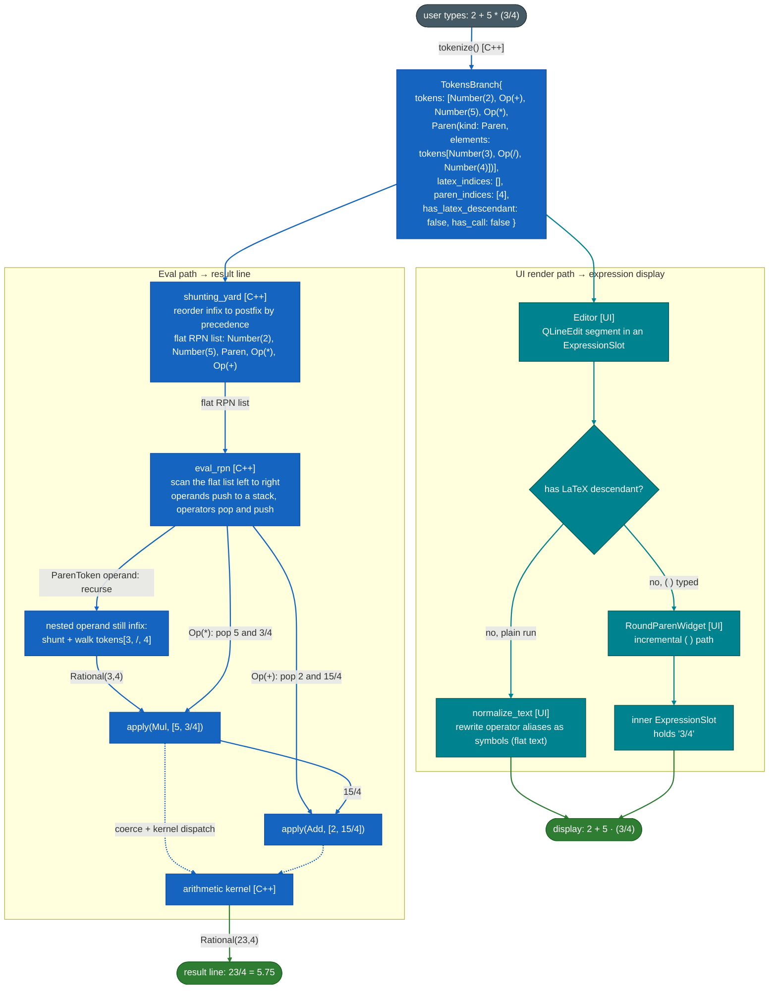
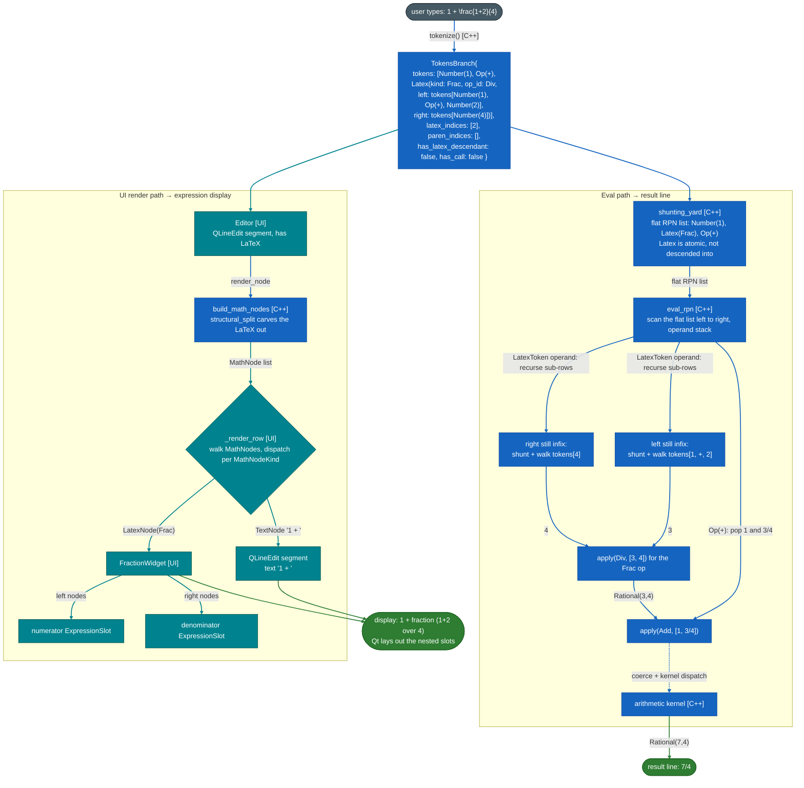
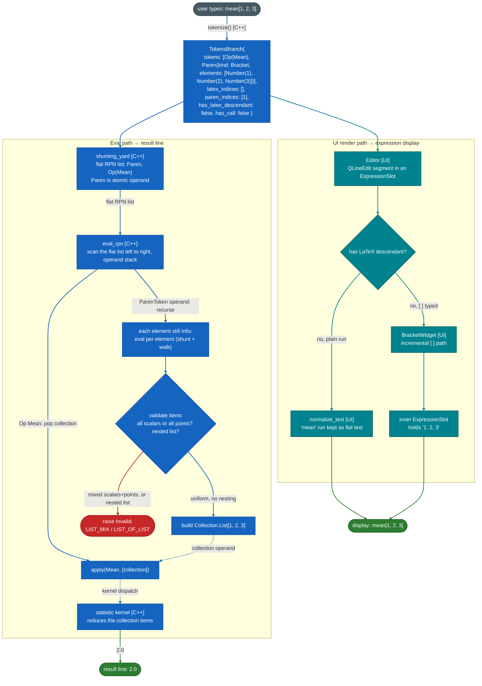

# Architecture

TCalc splits into a **native C++ core** and a **Python orchestration + UI layer**,
bridged by pybind11 as the `calc_native` module.

The native core owns everything hot, precise, or type-heavy: tokenizing the input
string, the whole evaluator (the assignment peel, `normalize`, `shunting_yard`, and the
RPN walk), the math kernels, the numeric value types (exact `Rational`, `BigReal`,
`Complex`, `BigComplex`), the `Collection` type, the variable store, and the declarative
**ops table** that both the tokenizer and the evaluator read from. An expression crosses
the boundary once: Python hands a `TokensBranch` to `evaluate()` and gets a value back.

The Python layer owns presentation and orchestration: it drives the PySide6 UI, builds
the render tree from the same tokens, and maps native exceptions to user-facing error
kinds. It does not compute anything itself.

In short: C++ is the deterministic engine, Python is the UI and orchestration layer that
is cheap to iterate on.

## Data flow

A keystroke becomes a result by tokenizing once, then running two paths off the same
`TokensBranch`:

- **Eval path** (`evaluate()`, entirely in C++) produces the computed value shown in the
  result line. It peels off an assignment if the row is one, then `shunting_yard`
  reorders the flat top-level token list from infix into a flat RPN list; the
  operand-carrying tokens (`Latex`, `Paren`, `Call`) are pushed atomically and are *not*
  descended into, so their inner token vectors stay infix. The RPN walk then scans that
  flat list left to right against an operand stack: scalar operands push, operators pop
  their operands and push the result. When the scan hits an atomic operand whose inner
  tokens are still infix (a fraction's numerator, a paren's elements), it recurses,
  shunting and walking that sub-list. `apply()` runs each operation: it homogenizes the
  operand types across the promotion ladder, dispatches to the kernel, and promotes the
  result on overflow or into the complex domain.
- **UI render path** turns the same tokens into the on-screen widget tree of the
  expression editor. When a LaTeX construct is present, `build_math_nodes` (via
  `structural_split`) produces a `MathNode` tree, and `_render_row` turns each node
  into a nested widget (`FractionWidget`, `ParenWidget`, ...) with its own `QLineEdit`
  slots. Plain text and bare parentheses take lighter incremental paths (alias
  normalization, a `ParenWidget`) and never build a structural tree. Qt lays the
  widgets out; there is no custom measure/paint step in the live editor. So the full
  widget tree is interesting only in the LaTeX example below.

The three diagrams trace both paths for the three shapes an expression can take. They
share the same spine (tokenize once, fan out); the differences are where the
interesting work happens.

`tokenize` and `build_math_nodes` are themselves multi-arm, recursive passes; their
internals (the token model, the classification arms, and the render-tree builder) live
in [parser.md](./parser.md). Below they appear as single steps.

### 1. Basic arithmetic: `2 + 5 * (3/4)`

A linear RPN walk, all in C++. A plain `( )` group holding a single element (arity-1: no
top-level comma) is just grouping: it evaluates recursively but returns a scalar, not
a collection.

### 2. LaTeX expression: `1 + \frac{1+2}{4}`

A LaTeX token is an atomic operand in the RPN stream. Its `left` and `right`
sub-rows are independently shunting-yard'd and evaluated, then the token's own op is
applied.

### 3. Collection: `mean[1, 2, 3]`

A `[ ]` (or `( )` point) is built into a native `Collection`, with validation, before any
op touches it. The same path serves the function-call form `mean(1, 2, 3)` (a `Call`
token) and reducers like `min` / `gcd`.

Collection building raises a few more validation errors that this example does not
hit, all from the collection arm of the evaluator: a point `( )` rejects a nested collection item
(`POINT_ITEM_COLLECTION`) and an empty `()` (`EMPTY_POINT`), and a `{ }` brace is not a
collection (`BRACE_UNSUPPORTED`). The call path adds arity checks: a fixed-arity call
with the wrong count (`takes_arguments`), a scalar function handed a collection
(`not_for_list_or_point`), and a call-only function typed bare without parentheses
(`needs_call_form`).

## Native layer (C++)

Under `src/native/`:

- `lib/calc/` math kernels (`arithmetic`, `trig`, `transcendental`, `combinatorics`,
  `number_theory`, `statistic`) behind the `Calculator` facade (`pub/calculator.hpp`).
  Errors are raised as `CalculatorError` with messages centralized in
  `pub/error_messages.hpp` (`tcalc::errmsg`).
- `lib/parser/` the token model and parsing (`pub/parser.hpp`): `tokenize`, the
  structural render-tree builder (`build_math_nodes`, `structural_split`), and the
  **ops table** (`pub/ops.hpp`). Internals in [parser.md](./parser.md).
- `lib/eval/` the evaluator (`pub/eval.hpp`): `evaluate` (assignment peel plus the walk),
  `normalize`, `shunting_yard`, `eval_rpn`, `apply` (the promotion ladder and kernel
  dispatch), `literal_value`, and the native variable store (`VarStore`).
- `lib/collection/` the immutable `Collection` (List / Point), stored as an array of
  typed-variant items (`CollectionItem`). (A columnar SoA representation is drafted but
  not yet implemented.)
- `lib/types.hpp` the numeric value types: exact `Rational` (`boost::rational`),
  `BigReal` (`cpp_dec_float_50`), `Complex`, `BigComplex`.
- `python/bindings/` pybind11 bindings (one file per type), assembled in
  `module.cpp` into the `calc_native` module.

## Python layer

Under `src/tcalc/`:

- `core/native_eval.py` the thin entry to the native evaluator: `evaluate_branch` calls
  `calc_native.evaluate` and maps a native `CalculatorError` (and its `ErrorKind`) to the
  Python error kind. It computes nothing itself.
- `core/parser.py` the `tokenize` and `tokenize_string` wrappers over `calc_native`. The
  render tree is built from the tokens they return.
- `core/ops.py` the Python mirror of the ops table, built at import time from
  `calc_native.op_table()`. There is no second source of truth. Because the
  `Operation` enum and friends are assembled dynamically at runtime, a type checker
  cannot see their members; `scripts/stubgen/generate_ops_stub.py` parses this module's
  AST and reconstructs them into a static `stubs/tcalc/core/ops.pyi`.
- `errors.py` `ErrorKind` plus the `Msg` tables for user-facing error text.
- `ui/` the PySide6 layer. `controller/` drives the loop (tokenize, live preview,
  status); `widgets/math/` renders the LaTeX-style nodes from `build_math_nodes`;
  `widgets/calc/display/` holds the expression editor and result.

## Key design decisions

- **The ops table is the single source of truth.** Each operation is one declarative
  `OpSpec` row (symbol, precedence, associativity, arity, aliases, native method name,
  call arity) defined once in C++. The tokenizer, the shunting-yard, and the evaluator
  all read the same table. Adding an op is a table entry plus a kernel function, not a
  new class in two languages.

- **The evaluator is native; Python is UI and orchestration.** An expression crosses the
  boundary once (`evaluate(branch)`), not once per operation. Everything deterministic
  or type-heavy (tokenizing, the RPN walk, arithmetic, type promotion, collection
  validation, error text, the variable store) lives in C++. Python drives the UI, builds
  the render tree, and maps native errors to user-facing kinds.

- **`Paren` and `Call` are distinct token kinds.** A function call carries an op id and
  multiple arguments; a paren carries grouping or collection elements. Keeping them
  separate lets `mean(1,2,3)` and `mean[1,2,3]` share collection-building while a call
  still knows its arity and rejects bare-infix forms.

- **Exact first, promote on demand.** Integers and fractions stay exact `Rational`s as
  long as possible. Values promote up the ladder (`Rational` -> `BigReal` /
  `Complex` -> `BigComplex`) only when an op needs it. Which arms an op supports is
  derived from the `Calculator` method signatures themselves, not from a hand-kept flag
  table, so it cannot drift.

- **All type stubs are generated, none hand-written.** Two generators feed `stubs/`,
  and `make stub-gen` runs both. The native module is a compiled extension with no
  Python source, so `pybind11-stubgen` introspects `calc_native` into
  `stubs/calc_native.pyi` (then a small `sed` patch fixes self-referential type names).
  The Python side builds its `Operation` enum and other tables dynamically at runtime,
  invisible to a type checker, so an AST-based generator (`scripts/stubgen/`)
  reconstructs them into static `.pyi` files. Keeping no stub by hand means the typed
  surface never drifts from the C++ table or the runtime-built tables: regenerate and
  it is correct by construction.
