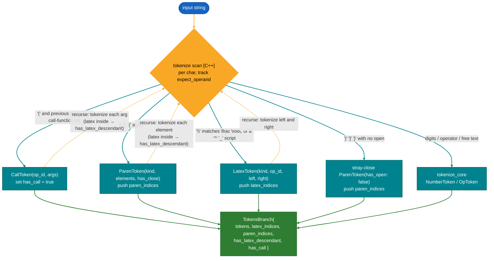
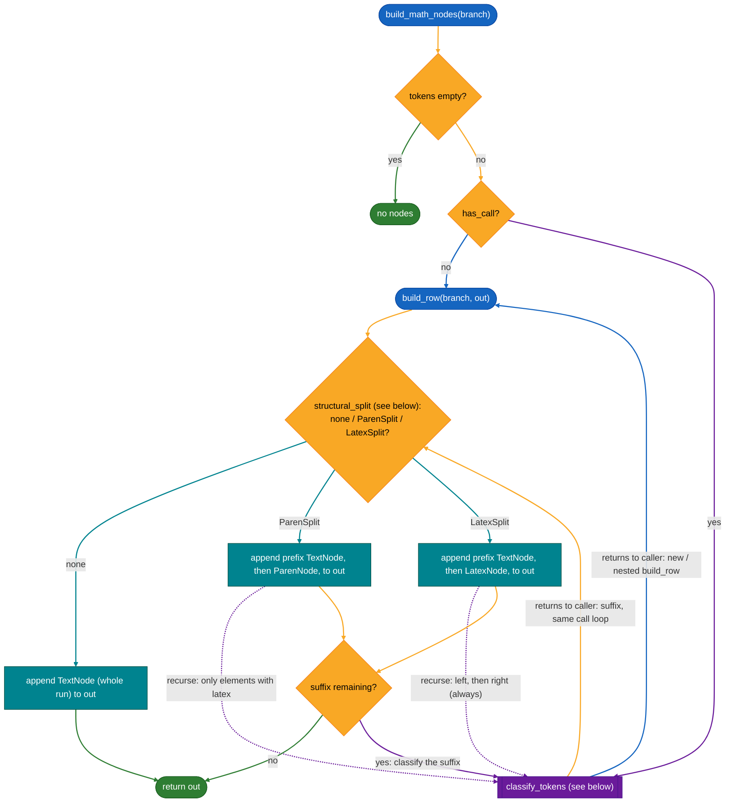
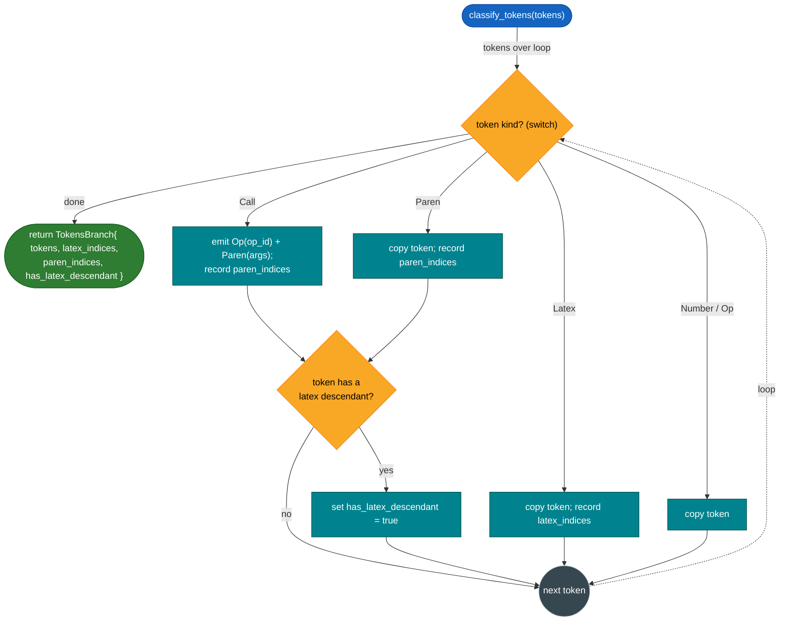
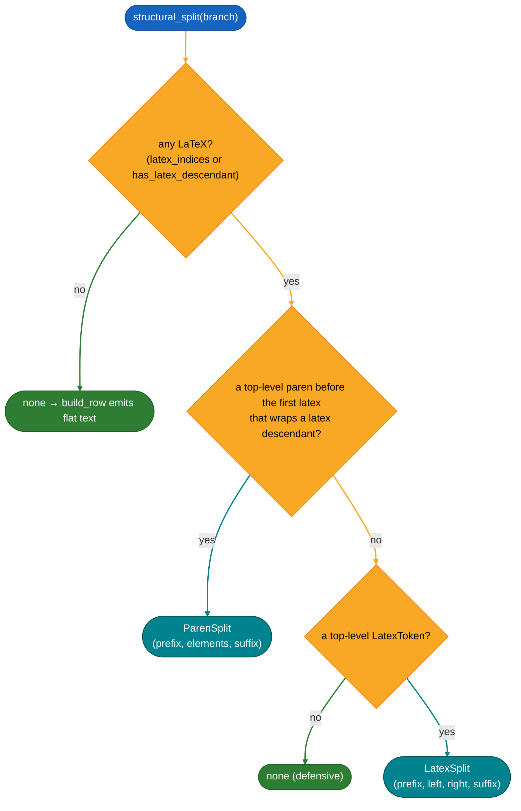
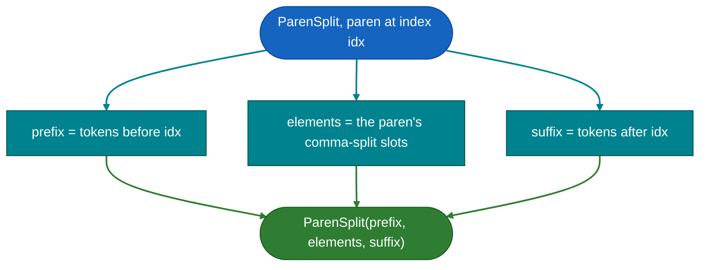
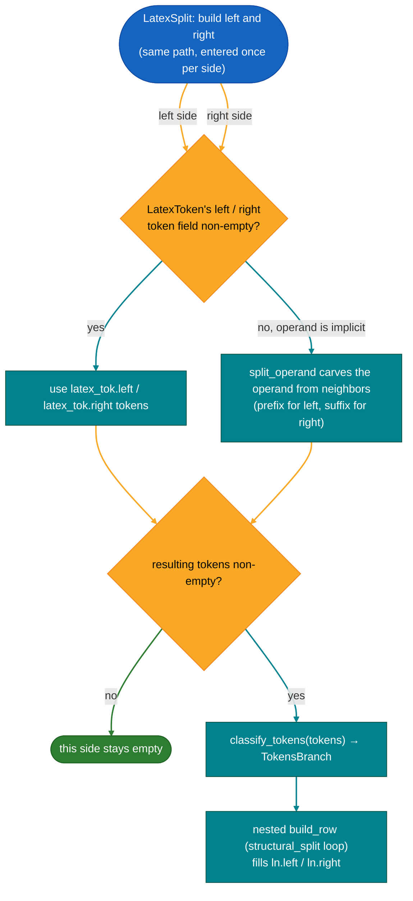

# Parser and render-tree internals

This zooms into the native C++ parser that [architecture.md](./architecture.md) treats
as single steps. It covers the token model, how `tokenize` classifies input,
`shunting_yard`, and how `build_math_nodes` turns tokens into the render tree. Read the
architecture overview first; this is the detail behind those boxes.

Everything here lives in `src/native/lib/parser/` (`parser.cpp`, `pub/parser.hpp`,
`pub/ops.hpp`).

## Token model

`tokenize` produces a `TokensBranch`:

```
TokensBranch {
    tokens                 // the flat token row
    latex_indices          // positions of top-level LatexTokens
    paren_indices          // positions of top-level ParenTokens
    has_latex_descendant   // a LaTeX token is nested inside a paren/call
    has_call               // any top-level CallToken (render-lowering gate)
}
```

The index/flag fields are computed during tokenize so later passes
(`structural_split`, the editor's render gate) never rescan. Each token is one of five
kinds:

| Kind     | Carries                                                           | Notes                                                    |
| -------- | ----------------------------------------------------------------- | -------------------------------------------------------- |
| `Number` | `value` (raw text)                                                | parsed to a value later, by native `literal_value`       |
| `Op`     | `op_id`                                                           | looks up its `OpSpec` (symbol, precedence, arity, flags) |
| `Latex`  | `kind`, `op_id`, `left`, `right`                                  | `left`/`right` are token vectors (still infix)           |
| `Paren`  | `kind` (Paren/Bracket/Brace), `elements`, `has_open`, `has_close` | grouping or collection                                   |
| `Call`   | `op_id`, `args`, `has_close`                                      | `f(arg0, arg1, …)`                                       |

A paren's `elements` (and a call's `args`) are split on the top-level commas: one
`ParenElement` per comma-separated slot. A `ParenElement` is a `variant<Token,
vector<Token>>`, a small-buffer optimization: a one-token slot is stored inline, a
multi-token slot as a vector. **Arity** is just the element count: arity-1 (no
top-level comma) is grouping, arity-N is a collection or a call's argument list.

`Op` behavior comes from its `OpSpec` row in the table (`pub/ops.hpp`): `precedence`,
`associativity`, `arity` (Binary / Unary / Postfix), the `CallFunction` flag, and
`call_arity` (1, a fixed N, or `kVariadicArity`). This is the single source the
tokenizer, shunting-yard, and evaluator all read. Which numeric types (BigReal,
Complex, Rational) an op supports is not a flag; the evaluator derives it from the
`Calculator` method signatures.

## Tokenize

`tokenize` scans the string character by character (tracking `expect_operand` to tell
a unary sign from a binary one) and classifies each piece. It is lenient: an unclosed
paren or a stray close is not an error, just a flagged token (`has_open` / `has_close`),
so the editor can render and evaluate while the user is still typing. The compound
kinds recurse: a LaTeX construct re-tokenizes its `left` and `right`, a paren
re-tokenizes its elements, a call re-tokenizes its args.

An open bracket is sorted into the paren family by a few checks. By default `(`, `[`,
`{` each open a **`ParenToken`** carrying its `kind` (`Paren`, `Bracket`, `Brace`), its
comma-split `elements`, and `has_open` / `has_close`; this is the data / grouping paren
(Point, List, brace group). A few checks divert from that default:

- a `(` **immediately after a call-function op** opens a **`CallToken`** instead (the
  call arm; the look-back behind it is explained below).
- the `{ }` of a LaTeX construct are not paren tokens at all: when the scanner hits `\`
  and it matches `\frac` / `\root`, the whole construct _and its
  braces_ are consumed into one **`LatexToken`** (via `extract_brace_content`). A `{`
  becomes a `Brace` `ParenToken` only when it stands alone, outside a LaTeX construct;
  a `\` that matches no construct is skipped.
- `^` and `_` are **direct entry chars** (no backslash): `fold_script` folds `^{…}`
  into a `Pow` `LatexToken` and `_{…}` into a `Subscript` one, taking the preceding
  operand as the base (see [script folding](#script-folding--and-_) below).

A close `)` `]` `}` with no matching open becomes a stray-close `ParenToken`
(`has_open: false`), kept rather than dropped so the editor stays stable mid-typing.



### Why a look-back, and dual-form functions

A call-function op is **dual-form**: `sin45` (or `sin 45`) stays a bare unary `Op`,
applied to the next operand by the normal RPN rules, while `sin(45)` becomes a
`CallToken`. The op itself commits to neither form; the `(`, or its absence, decides.

A look-back is the natural place to decide because **the ambiguity lives in the `(`, not
the op**: the same `(` is an argument list after `sin`, but a Point after nothing
(`(2,3)`) and grouping inside an expression (`(2+3)`). Only the preceding token
disambiguates it, so the decision belongs where the `(` is scanned, reusing the
paren-extent scan and comma-split that already run there.

Deciding eagerly instead (turn every call-function op into a `CallToken` at op time,
then attach a paren if one follows) would break the dual form: `sin45` would leave the
`CallToken` with no arguments and a dangling `45`, forcing unary application to be
re-implemented inside the call path, duplicating what shunting-yard and eval already do.
It also fights the tokenizer's shape, since ops are emitted in runs by `tokenize_core`
while the `(` that ends a run is handled one step later in the main loop.

Two consequences worth stating:

- a bare call-**only** op (`mod`, `nCr`, `intdiv`, which have no infix form) stays an
  `Op` when typed without parens and is rejected at eval with "must be written as
  `mod(...)`" (`needs_call_form`), rather than silently becoming an argument-less call.
- `[ ]` is never a call: `mean[1,2,3]` is `Op(Mean) + ParenToken(Bracket)` (a collection
  operand). Only a `(` directly after a call-function op is a call.

### Script folding: `^` and `_`

`^` and `_` are LaTeX construct entry chars in their own right, not `\`-macros: the
scanner hits one and `fold_script` builds a `LatexToken`, `^` -> `Pow`, `_` ->
`Subscript`. The **base** comes from a look-back, exactly like the call `(`:
`fold_script` pops the preceding operand token and stores it as the token's `left`. At
an operand position (start of the expression, or right after an operator) there is no
preceding operand, so the base is empty. The **script** is the `{ }` content
re-tokenized, or empty when the sigil is bare.

Two consequences follow from that, both mirroring rules already stated above:

- **Bare sigils fold too.** `^` and `_` are entry chars rather than `^{`-only triggers,
  so a caret typed between operands, or a pasted `3^4`, still builds a `Pow` with an
  empty script instead of a dead infix operator that never renders. The widget appears
  the moment the key is pressed.
- **The trailing operand is not grabbed.** Just as `2+4` tokenizes to `[N(2), Op(+),
  N(4)]` without the scanner grouping operands around the `+`, `3^4` tokenizes to
  `[Pow(base: 3, script: {}), N(4)]`, the `4` left as a sibling. Looking back for the
  base is cheap and unambiguous (a finished token sits there); looking forward into raw,
  unscanned exponent text would need delimiters or precedence rules the scanner does not
  carry. `build_math_nodes` folds that trailing operand into the empty script on the
  editor round-trip (`3^4` -> `3^{4}`), the same layer that groups operands around any
  operator.

`Pow` carries the real `Pow` `OpId`; `Subscript` carries the `OpId::Count` sentinel and
has no arithmetic kernel, so eval never derefs its `OpSpec` and instead reads a
subscripted token as a variable name / index (`n_{2}`). Both serialize as
`base<sigil>{script}` (`2^{3}`, `x_{2}`); flat text strips the braces for readability
(`x_{2}` -> `x_2`).

The look-back skips an operator, since an operator is not an operand, with one exception:
`log` claims a script the way a name does, because a logarithm's script is the base it is
taken in. So `log_{2}` folds into a single `Subscript` whose `left` is the `Op(Log)`,
exactly as `x_{2}` folds the name, and eval reads the base back off there (see
[eval](#shunting_yard-to-rpn)). `log` with no script keeps base ten. A logarithm has no
latex spelling and no `LatexKind` of its own.

## shunting_yard (to RPN)

`shunting_yard` reorders one flat token list from infix into a flat RPN list (after a
`normalize` pass that fixes unary signs). It is the classic algorithm with one twist:
`Number`, `Latex`, `Paren`, and `Call` are all treated as **atomic operands** and go
straight to the output; only `Op` tokens use the operator stack, popping by
`precedence` / `associativity` from each `OpSpec`.

Because the compound operands are atomic here, their inner token vectors (a LaTeX
token's `left` / `right`, a paren's `elements`, a call's `args`) stay infix. They are
shunting-yarded again, recursively, only when the evaluator reaches them. That
recursive re-shunt is shown in the eval-path diagrams in
[architecture.md](./architecture.md).

## build_math_nodes (render tree)

This is the render path's first step: turning the flat token list into the `MathNode`
tree the UI lays out. Think of a **row** as one horizontal line of math: a left-to-right
sequence of plain text runs and 2D boxes (a fraction, a parenthesized group), where each
box carries its own inner row(s). The result of rendering is exactly such a row, hence
`vector<MathNode>`.

`build_math_nodes` is the entry point; `build_row` is the recursive worker that builds
any one row. `build_row` walks a token list once and emits, in order, what to draw: it
copies plain stretches out as `TextNode` text, and whenever it meets something that needs
2D layout (a fraction, or a paren that contains one) it emits a `LatexNode` / `ParenNode`
and recurses to build that box's inner row(s). So one row is an **ordered mix**, e.g.
`[TextNode, LatexNode, TextNode, ParenNode]`, and because the boxes hold sub-rows the
whole result is a **MathNode tree**. When a line has no 2D structure at all, the row is
just one `TextNode`, the whole line as flat text.

`structural_split` returns more than the structure itself: a `LatexSplit` / `ParenSplit`
also carries the **prefix** (the tokens before the structure) and the **suffix** (the
tokens after it). `build_row` emits the prefix as a leading `TextNode` and then loops on
the suffix, so a rendered fraction always sits in its row between whatever surrounds it,
which is what lets the user write text before and after it. An empty prefix or suffix
emits **nothing**: `emit_text` skips empty text and an empty suffix just ends the loop,
so the tree never holds an empty `TextNode` or an empty row. (The editor adds its own
empty `QLineEdit` segment around each widget so there is always somewhere to click and
type, even when the prefix or suffix carried no text.)

Two kinds of "back to the start" appear in the diagram: the **suffix** after a
structural node continues in the _same_ call (the loop edge back to `structural_split`),
while a paren's elements and a LaTeX node's `left` / `right` are _nested_ `build_row`
calls (the recursion edges back to the `build_row` entry).

The critical decisions:

- an **empty token list** (nothing typed, or an empty sub-expression) → no nodes.
- **`has_call`** → `classify_tokens` first lowers each `CallToken` to `Op + Paren`, so
  calls render through the existing op/paren path with no dedicated Call node.
- **no LaTeX in the row** (the common case) → one flat `TextNode`, no tree. This is the
  same gate the editor uses to decide whether to build widgets at all.
- otherwise the first structural node is either a top-level paren that wraps a LaTeX
  descendant (a `ParenNode`) or the first top-level `LatexToken` (a `LatexNode`).
- **The `has_latex_descendant` gate.** A paren, a bracket, or a lowered call's parens
  are promoted to a `ParenNode` _only_ when they wrap a LaTeX descendant. A plain `(1+2)`,
  `[1,2,3]`, or `gcd(12,8)` has no latex operations to lay out in 2D, so it is flattened
  into a `TextNode` by `tokens_to_text`, parentheses and all. So `(\frac{(1+2)}{2})` becomes a
  `ParenNode` around a `LatexNode`, but `(1+2)` part still stays the text `"(1+2)"`.
  This is why a no-LaTeX row collapses to one `TextNode`, and why a call's parentheses
  get a `ParenWidget` only when an argument itself contains LaTeX.
  _The flag is precomputed at tokenize time, so this gate is a field read, never a rescan_.



#### classify_tokens

A single pass that rebuilds a `TokensBranch` from a raw token list: it lowers each
`CallToken` to `Op + Paren` (render-only, no Call node), records where the LaTeX and
paren tokens sit, and aggregates `has_latex_descendant`. It is called in three spots,
each feeding its `TokensBranch` into a `build_row` (or back into its loop):
`build_math_nodes` on the top branch when it has calls, `build_row` on every sub-row it
recurses into, and `build_row` on each `suffix` before the next loop iteration.



#### structural_split

Finds the **first** structural node to carve out of a row, or nothing. A paren that
wraps a LaTeX descendant and sits before the first top-level LaTeX token wins (a
`ParenSplit`); otherwise the first top-level LaTeX token does (a `LatexSplit`). Either
split also carries the surrounding `prefix` and `suffix` spans. With no LaTeX anywhere it
returns nothing, and `build_row` flattens the row to text.



**ParenSplit** has no control point, it is pure slicing: the paren sits at index `idx`,
so the prefix is everything before it, the suffix everything after, and the elements are
the paren's own comma-split slots.



**LatexSplit** is where the control points are. Its `left` and `right` are built the
**same way**, entered once per side. A side's tokens come from the `LatexToken`'s own
`left` / `right` token field; when that field is empty the operand is implicit (it sits
in the surrounding expression), so `split_operand` carves it from the neighbor tokens
(the prefix for `left`, the suffix for `right`). If the resulting tokens are non-empty
they go through `classify_tokens` and then a nested `build_row` (which runs
`structural_split` again) to fill that side:


